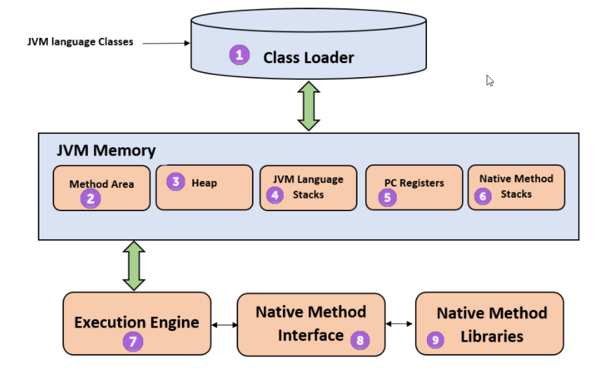

### 목차
- [JVM이란 무엇인가](#JVM이란-무엇인가)
- [바이트 코드](#바이트-코드)
- [JVM의 특징](#JVM의-특징)
- [JVM의 구조](#JVM의-구조)
- [JIT 컴파일러](#JIT-컴파일러)
- [JDK와 JRE](#JDK와-JRE)
- [컴파일 하는 방법](#컴파일-하는-방법)
- [실행하는 방법](#실행하는-방법)

### JVM이란 무엇인가
JVM이란 자바 프로그램을 실행하기 위해 필수적인 런타임 환경을 제공하는 프로그램이다.
하드웨어와 OS에 맞는 적절한 JVM이 없을 경우 자바 프로그램을 실행할 수 없다.

자바 프로그램이 자바 소스 코드 그대로 있어서는 JVM에서 실행될 수 없다.
JVM에서 실행되기 위해서는 자바 소스코드가 바이트코드로 변환(컴파일)되어야 한다.
이때 바이트코드는 반드시 클래스 파일(.class)의 형태로 JVM에 제공되어야 한다.
JVM은 인터프리터를 통해 바이트 코드 인스트럭션을 한 번에 하나씩 읽어 해석한다.

### 바이트 코드
JVM을 컴퓨터 속의 컴퓨터라고 생각한다면, 바이트코드를 컴퓨터 속의 컴퓨터의 CPU를 위한
기계어라고 생각하면 쉽다. 사실 바이트코드는 실제 하드웨어 프로세서에 의해 실행되는
기계어와 매우 유사하지는 않다. 소스 코드와 기계어의 중간쯤에 위치한 것으로 보면 된다.
바이트코드는 JVM의 인터프리터가 효율적으로 코드를 해석할 수 있도록 만들어진 포멧이다.

### JVM의 특징
- 애플리케이션 코드를 실행시키는 컨테이너의 역할을 한다.
- C와 C++에 비해 안전한 실행 환경을 제공한다.
- 메모리를 관리한다.
- 플랫폼에 독립적인 실행 환경을 제공한다.

### JVM의 구조

 https://www.guru99.com/java-virtual-machine-jvm.html

JVM 런타임 메모리 영역은 크게 두 가지로 그룹으로 나눌 수 있다.

- 스레드별로 갖는 영역: PC(5), JVM 스택(4), 네이티브 메소드 스택(6)
 이 영역의 데이터는 스레드가 시작할 때 초기화되고, 스레드가 완료될 때 제거된다.
- 모든 스레드가 공유하는 영역: 힙(3), 메소드 영역(2), 런타임 상수 풀
 이 영역의 데이터는 JVM이 시작할 때 초기화되고, JVM이 종료될 때 제거된다.

#### PC
PC는 스레드에서 현재 실행중인 instruction을 가리킨다.
자바는 멀티스레딩을 지원하므로 PC는 새로운 스레드가 생성될 때마다 생성된다.
(만약 현재 실행중인 메소드가 ‘native’하다면 PC의 값은 정의되지 않는다.) 

#### JVM 스택
JVM 스택은 JVM의 프레임을 저장하는데 사용된다.
JVM은 스택에 대해 어떤 직접적인 조작도 하지 않고 그냥 프레임을 저장한다.
스택의 메모리 크기는 고정적일 수도 있고 가변적일 수도 있다.
가변적인 크기는 필요에 따라 동적으로 확장된다.
JVM 프레임은 메소드가 호출될 때 생성되며, 동적 링킹을 수행한다.
JVM 스택은 스레드마다 생성되며 관리된다.

-StackOverflowError
 JVM 스택의 크기가 고정적일 때, 메모리의 크기가 프로그램의 실행 동안 충분하지 않을 경우 일어나는 에러이다.
 -OutOfMemoryError
 동적 크기의 스택에서, 더 많은 공간이 필요하지만 할당가능한 공간이 없을 때 일어나는 에러이다.

#### 힙
클래스나 배열의 객체를 저장할 때 사용되는 곳으로 모든 스레드에서 공유하는 자원이다.
가비지 컬렉터가 활동하는 영역이기도하다.
힙은 가상머신이 시작할 때 생성되며, 메모리 회수는 가비지 컬렉터에 의해 자동으로 이루어진다.
런타임에 할당된 메모리가 충분하지 않을 경우 JVM은 OutOfMemoryError를 던질 수 있다.

#### 메소드 영역
클래스 이름, 경로, 클래스의 정적 변수, 메소드 데이터, 메소드, 생성자 코드, 동적 상수풀과 같이
클래스에 대한 정보를 가지고 있다. 메소드 영역은 JVM이 시작할 때 생성되며, 모든 스레드들이 공유한다.
JVM은 런타임에 할당된 메모리가 충분하지 않을 경우 OutOfMemoryError를 던진다.

#### 런타임 상수 풀
클래스나 인터페이스가 생성되었을 때 JVM에 의해 생성된다.
클래스나 인터페이스에서 이용 가능한 상수 풀 테이블을 가지고 있다.
리터럴를 포함한다. 동적 상수풀을 할당할 메모리를 찾지 못하면 OutOfMemoryError가 발생한다.

#### 네이티브 메소드 스택
native 메소드를 지원하는 JVM은 네이티브 메소드 스택을 갖는다.
네이티브 메소드를 위해 사용되며 스레드마다 생성된다.
만약 네이티브 메소드가 JVM에 의해 로드될 수 없다면 네이티브 메소드 스택을 가질 필요 없다.
JVM 스택과 마찬가지로 스택의 크기가 고정적이라면 StackOverflowError를,
가변적이지만 할당가능한 공간이 부족할 경우 OutOfMemoryError를 던진다.

### JIT 컴파일러
자바 프로그램이 실행되는 동안 프로그램의 모든 부분이 동등하게 호출되지는 않는다.
다른 것에 비해 유독 많이 호출되는 부분이 존재한다.
자바 플랫폼은 이러한 사실과 JIT(Just In Time) 컴파일러라는 기술을 이용하여 JVM을 최적화한다.

JIT 컴파일러는 프로그램이 실행되고 컴파일된 뒤에 실행되는 런타임 컴파일러로
일반적인 컴파일러와 달리 런타임의 정보에 접근할 수 있어 코드를 최적화할 수 있다.
많이 호출되는 부분을 인터프리터에서 매번 해석할 필요 없도록 기계어로 컴파일함으로써
최적화를 수행한다.

https://stackoverflow.com/questions/95635/what-does-a-just-in-time-jit-compiler-do

### JDK와 JRE
JRE
 Java Runtime Environment, 자바 프로그램을 실행하기 위해 필요한 환경
 JDK
 Java Development Kit, 자바 프로그램을 개발하기 위해 필요한 환경

### 컴파일 하는 방법
윈도우의 경우 명령 프롬프트에서 javac 명령어를 이용하여 자바 프로그램을 컴파일할 수 있다.

`javac Hello.java`

### 실행하는 방법
윈도우의 경우 명령 프롬프트에서 java 명령어를 이용하여 컴파일된 자바 프로그램을 실행할 수 있다.
(컴파일 할 때와는 달리 확장자를 붙이지 않는다.)

`java Hello`