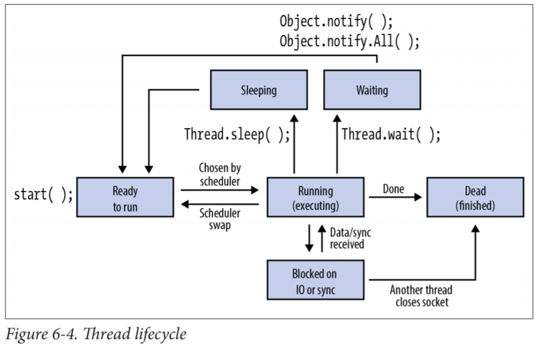

## 10주차 live-study 목차
- [쓰레드](#쓰레드)
    - [쓰레드를 만드는 방법](#쓰레드를-만드는-방법)
    - [메인 쓰레드](#메인-쓰레드)
    - [쓰레드 상태](#쓰레드-상태)
    - [쓰레드 우선순위](#쓰레드-우선순위)
- [동기화](#동기화)
    - [Thread interference](#Thread-interference)
    - [Memory consistency errors](#Memory-consistency-errors)
    - [Synchronized methods](#Synchronized-methods)
    - [Intrinsic locks](#Intrinsic-locks)
    - [Synchronized statements](#Synchronized-statements)
    - [Reentrant synchronization](#Reentrant-synchronization)
    - [Deadlock](#Deadlock)
    - [Thread contention](#Thread-contention)
    - [Starvation](#Starvation)
    - [Livelock](#Livelock)
- [참고](#참고)

### 쓰레드
쓰레드란 자바 코드를 실행할 수 있으면서 프로세스보다는 작고 가벼운 실행 단위이다.
쓰레드는 프로세스에 속하며 운영체제가 실행시킬 수 있다.
한 프로세스에 속하는 모든 쓰레드는 주소 공간을 공유한다.
각 쓰레드는 독립적으로 스케줄링될 수 있고, 자신만의 스택과 프로그램 카운터를 가질 수 있지만
같은 프로세스 내의 다른 쓰레드와 메모리를 공유한다.

#### 쓰레드를 만드는 방법
자바에서 쓰레드를 만드는 방법은 `Thread` 클래스의 인스턴스를 만든 뒤 start() 메소드를 통해 실행시키는 것이다.
`Thread` 인스턴스를 만들 때는 쓰레드에서 동작될 코드를 반드시 제공해야 하는데 여기에는 두 가지 방법이 있다.

1. `Runnable` 오브젝트 이용

`Runnable` 인터페이스는 `run()`이라는 하나의 메소드를 정의하는데 이 메소드가 바로 쓰레드에서 동작될 메소드이다.
다음과 같이 `Runnable` 객체를 `Thread` 생성자의 인자로 전달함으로써 쓰레드에서 동작될 코드를 제공할 수 있다.
```java
public class HelloRunnable implements Runnable {

    public void run() {
        System.out.println("Hello from a thread!");
    }

    public static void main(String args[]) {
        (new Thread(new HelloRunnable())).start();
    }

}
```

2. `Thread`의 자식 클래스 이용

`Thread` 클래스는 `Runnable` 인터페이스를 구현하고 있다. 그러나 `Thread` 클래스의 `run()` 메소드는
아무 의미가 없기 때문에 `Thread`를 상속받는 자식 클래스를 만든 뒤 `run()` 메소드를 오버라이드함으로써 쓰레드에서 동작될 코드를 제공할 수 있다.
```java
public class HelloThread extends Thread {

    public void run() {
        System.out.println("Hello from a thread!");
    }

    public static void main(String args[]) {
        (new HelloThread()).start();
    }

}
```

1번 방법에서 보았듯 `Runnable`을 이용하여 쓰레드를 만드는 게 더 일반적이다.
2번 방법은 간단한 애플리케이션에서 사용하기는 더 쉽지만 반드시 `Thread`의 자식 클래스여야 한다는 제약이 있는 반면,
1번 방법은 다른 어떤 클래스의 자식 클래스도 될 수 있기 때문에
더 유연할 뿐 아니라 high-level 쓰레드 관리 API에 적용될 수 있는 방식이기 때문이다.

#### 메인 쓰레드
자바 프로그램이 실행되는 과정
1. 프로그래머가 특정 클래스를 실행시킨다.
2. JVM(모든 자바 프로그램이 실행되는 컨텍스트)이 구동된다.
3. JVM은 전달된 인자를 확인하고 프로그래머가 엔트리 포인트(특정 클래스의 main 메소드)에서 시작되는 실행을 요청했는지 확인한다.
4. 클래스가 클래스로딩 관련 확인사항을 통과하면, 프로그램의 실행을 위해 지정된 쓰레드(메인 쓰레드)가 시작된다.
5. JVM 바이트코드 인터프리터는 메인 쓰레드 위에서 실행된다.
6. 메인 쓰레드의 인터프리터는 main 메소드의 바이트코드를 읽어가며 실행시킨다.

메인 쓰레드란 프로그램의 실행을 위해 지정된 쓰레드로, 프로그램이 실행되면 실행된다. 

#### 쓰레드 상태
`getState()`를 통해 쓰레드의 상태를 확인할 수 있다.
자바에서는 `Thread.State` 이늄을 통해 쓰레드의 상태를 표현하기 때문에
`getState()`는 `Thread.State` 타입을 객체를 리턴한다.

* NEW: 쓰레드가 생성되었으나 `start()` 메소드가 호출되지 않은 상태(모든 쓰레드의 시작 상태).
* RUNNABLE: 쓰레드가 실행중이거나 운영체제가 스케줄링하는 시점에서 이용가능한 상태.
* BLOCKED: `synchronized` 메소드나 블럭에 진입하고자 락을 얻기 위해 대기하는 상태.
* WAITING: `Object.wait()` 메소드나 `Thread.join()` 메소드에 의해 멈춰있는 상태.
* TIMED_WAITING: `Thread.sleep()` 메소드나 `Object.wait()`, `Thread.join()` 메소드가 타임아웃 값과 함께 호출되어,
무한히 기다리는 것이 아니라 시그널이 오지 않더라도 일정 시간 동안만 멈춰있는 상태.
* TERMINATED: 쓰레드의 실행이 완료된 상태.


<br>출처: Java in a Nutshell 7th 

#### 쓰레드 우선순위
`getPriority()`와 `setPriority()`를 통해 쓰레드의 우선순위를 관리할 수 있다.
스케줄러는 쓰레드 우선순위를 어떻게 처리할 것인기 결정한다.
쓰레드 우선순위를 처리하는 한 가지 방식은 높은 우선순위의 쓰레드가 기다리고 있을 때
낮은 우선순위의 쓰레드가 실행되지 못하도록 하는 것이다.
대부분의 경우에 스케줄러가 우선순위를 어떻게 해석할 것인지에 대해 영향을 미칠 수 있는 방법은 없다.
쓰레드 우선순위는 1부터 10까지의 정수로 표현되며 10이 가장 높은 우선순위를 나타낸다.

### 동기화
쓰레드들은 주로 필드를 공유하며 소통한다. 이러한 형태의 소통은 매우 효율적이지만
두 가지 에러를 만들 가능성이 있다. 하나는 thread interference이고 다른 하나는 memory consistency erros이다.
동기화란 이런 에러를 막아주는 도구이다. 자바는 두 가지 동기화 방법을 제공한다. `synchronized` methods와 `synchronized` statements이다.
먼저 쓰레드가 필드를 공유함에 따라 발생할 수 있는 에러에 대해 살펴보고 이를 막기 위해 동기화 하는 방법을 알아본다.

#### Thread interference
쓰레드 A와 B가 같은 변수 c를 사용하는데, A는 c의 값을 증가시키고, B는 c의 값을 감소시킨다고 가정해보자.
* Thread A: c(초깃값 0)를 획득한다.
* Thread B: c를 획득한다.
* Thread A: c를 1 증가시킨다.
* Thread B: c를 1 감소시킨다.
* Thread A: 연산 결과를 c에 저장한다. 이때 c는 1이다.
* Thread B: 연산 결과를 c에 저장한다. 이때 c는 -1이다.

쓰레드 B의 연산 결과가 쓰레드 A의 연산 결과를 덮어썼다. 사용자는 1 감소시키는 쓰레드와
1 증가시키는 쓰레드를 실행시켰으니 두 쓰레드가 끝난 결과 값은 0일 것이라고 기대하겠지만
A가 먼저 끝나면 B가 A를 덮어씀으로써 결과는 -1이 되고, B가 먼저 끝나면 결과가 1이 된다.
만약 한 쓰레드가 먼저 끝난 뒤에 다른 쓰레드가 실행된다면 결과는 0이 나와서
마치 프로그램에 문제가 없는 것처럼 보일지도 모른다.
예상과 다른 값이 나올 수 있을 뿐 아니라 결과값이 항상 일관되게 보장되지도 않는 이런 상황은
쓰레드가 같은 자원을 공유함에 따라 의해 발생할 수 있는 문제이다.

#### Memory consistency errors
Memory consistency errors는 말 그대로 서로 다른 쓰레드들이 가지고 있는 데이터의 일관성이 깨질 때 발생한다.
쓰레드 A와 B가 있고, 둘 모두 초깃값이 0인 counter라는 변수를 가지고 있을 때 A는 counter를 1 증가시키고, B는 이를 출력한다고 가정해보자.
B의 결과 counter 값이 0이 출력될 수도 있지만 1이 출력될 수도 있다. A가 보는 counter와 B가 보는 counter가
마땅히 같아야 하는데 서로 다르게 보고 있는 것(일관성이 깨진 것)이다.

이 에러를 피하는 방법은 happens-before 관계를 맺는 것이다.
Happens-before 관계는 특정 statement의 메모리 쓰기가 다른 statement에게 보이도록 보장한다.
앞선 예시에서 쓰레드 B의 출력 결과가 0일 수도 있었던 이유가 바로 쓰레드 A의 변화가
쓰레드 B에게도 보인다는 보장이 없었기 때문이다.
프로그래머가 두 statements 간에 happens-before 관계를 만들어준다면(서로의 변화가 서로에게 보이도록 해준다면)
memory consistency errors를 피할 수 있다. 이 관계를 만드는 방법 중 하나가 동기화이다.

#### Synchronized methods
메소드의 선언부에 `synchronized` 키워드를 추가함으로써 `synchronized` methods를 만들 수 있다.
```java
public class SynchronizedCounter {
    private int c = 0;

    public synchronized void increment() {
        c++;
    }

    public synchronized void decrement() {
        c--;
    }

    public synchronized int value() {
        return c;
    }
}
```
이렇게 `synchronized` 메소드로 만들면
1. 하나의 SynchronizedCounter 객체의 `synchronized` 메소드는 둘 이상의 쓰레드가 동시에 사용할 수 없게 된다.
한 쓰레드가 이 객체의 `synchronized` 메소드를 실행중인 경우 이 객체의 `synchronized` 메소드를 호출하고자 하는
다른 모든 쓰레드들은 첫 쓰레드의 `synchronized` 메소드가 끝날 때까지 블락된다. (Type interference 해결)
2. `synchronized` 메소드가 종료될 때, 동일 객체의 `synchronized` 메소드에 대한 다음번 호출과 자동으로 happens-before 관계를 맺는다.
즉, 객체 상태의 변화가 모든 쓰레드들에게 보이도록 보장한다. (Memory consistency errors 해결)

참고로 생성자는 `synchronized` 될 수 없다. 생성자에 `synchronized` 키워드를 사용하면 문법 에러이다.

`synchronized` 메소드는 thread interference와 memory consistency errors를 막는 가장 간단한 전략이다.
효과적인 전략이지만 liveness와 관련된 문제(deadlock, starvation, livelock)가 발생할 수 있다.

#### Intrinsic locks
동기화는 intrinsic lock 또는 monitor lock으로 알려진 내부 엔티티에 의해 이루어진다.
Intrinsic locks는 동기화를 위해 다음의 두 가지 역할을 한다.
1. 객체 상태에 대한 배타적인 접근(한 번에 하나만)을 강제한다.
2. Happens-before 관계를 형성한다.

모든 객체는 intrinsic lock을 갖는다. 특정 객체의 필드에 대한
배타적이고 일관된 접근을 원하는 쓰레드는 접근하기 전에 먼저 intrinsic lock을 획득해야만 한다.
쓰레드가 intrinsic lock을 획득하고 락을 풀기까지의 기간 동안
쓰레드가 intrinsic lock을 소유했다고 표현한다.
쓰레드가 intrinsic lock을 소유하는한 다른 쓰레드는 같은 락을 획득할 수 없다.
이미 다른 쓰레드가 소유한 락을 획득하기 위해 시도하는 쓰레드는 블락된다.

쓰레드가 `synchronized` 메소드를 호출하면, 그 메소드의 오브젝트에 대한
intrinsic lock을 획득하고 메소드가 리턴될 때(메소드의 리턴이 잡히지 않은 예외에 의한 것이라고 할지라도) 락을 release한다.

`static` `synchronized` 메소드는 어떨까?
이 경우 쓰레드는 해당 클래스의 `Class` 객체에 대한 intrinsic lock을 획득한다.

#### Synchronized statements
`synchronized` 코드로 만드는 다른 방법은 `synchronized` statements이다.
`synchronized` 메소드와 달리 `synchronized` statements는 반드시 intrinsic lock을 제공하는 객체를 명시해야만 한다.

```java
public void addName(String name) {
    synchronized(this) { // intirnsic lock 제공하는 객체 명시
        lastName = name;
        nameCount++;
    }
    nameList.add(name);
}
```

`synchronized` 메소드와 `synchronized` statements의 차이점은
위에서 볼 수 있듯 `synchronized` statements는 메소드 전체가 아니라 일부에 대해
`synchronized` 블럭을 설정할 수 있다는 점이다. 또한 `synchronized` 메소드는
락을 제공하는 대상이 그 메소드의 오브젝트 또는 클래스로 정해져 있지만,
`synchronized` statements에서는 원하는 대상을 명시할 수 있다.


#### Reentrant synchronization
다른 쓰레드가 소유하고 있는 락을 획득하는 것은 불가능하지만, 자신이 이미 소유하고 있는 락을 획득하는 것은 가능하다.
Reentrant synchronization이란 `synchronized` 코드가 직/간접적으로
`synchronized` 코드가 담긴 메소드(자신이 소유한 락을 제공하는 객체의 또 다른 메소드)를 호출한 상황을 말한다. 
쓰레드가 같은 락을 한 번 이상 획득할 수 있게하면 reentrant synchronization이 가능하다.

#### Deadlock
Deadlock은 둘 이상의 쓰레드가 상대방을 기다리며 영원히 블락된 상태를 의미한다.


<br>출처: https://medium.com/@abhishekdesilva/avoiding-deadlocks-and-performance-tuning-for-mssql-with-wso2-servers-c0014affd1e

예를 들어 머리를 숙여 인사를 할 때 상대방이 인사를 받아줄 때까지 머리숙인 상태를 유지해야 한다고 가정해보자.
A와 B가 서로를 발견하고 동시에 머리를 숙인다면 A는 B가 인사를 받아주기를 기다리고,
B는 A가 인사를 받아주기를 기다리며 둘 모두 영원히 머리 숙이고 있을 것이다.

#### Thread contention
동기화는 둘 이상의 쓰레드가 같은 자원에 대해 동시에 접근하는 쓰레드 경쟁을 야기할 수 있다.
쓰레드 경쟁이 발생하면 자바 런타임이 쓰레드를 실행하는 속도가 매우 느려지거나 심지어는 쓰레드를 중단시킬 수도 있다.
Startvation과 livelock이 쓰레드 경쟁의 예시이다.

#### Starvation
쓰레드가 공유 자원에 접근을 할 수 없어서 더 이상 진행하지 못하는 상황을 말한다.
탐욕적인 쓰레드가 공유 자원을 오랫동안 사용하고 있을 때 발생한다.
예를 들어 한 객체가 리턴하는데 오랜 시간이 걸리는 `synchronized` 메소드를 제공한다고 가정해보자.
만약 한 쓰레드가 이 메소드를 빈번하게 호출한다면 이 객체에 대해 자주 `synchronized` 접근을 해야하는
다른 쓰레드들이 블락되는 일이 잦을 것이다. 

#### Livelock
쓰레드는 종종 다른 쓰레드가 어떤 행동을 하면 그것에 대한 응답으로 어떤 행동을 한다.
만약 다른 쓰레드의 어떤 행동이 또 다른 쓰레드의 행동에 대한 응답이라면 livelock이 발생할 수도 있다.
Deadlock과 마찬가지로 livelocked 쓰레드 역시 더이상 쓰레드가 진행되지 못한다.
하지만 deadlock과 다른 점은 livelocked 쓰레드는 블락된 상태가 아니라는 것이다.
이들은 상대방에게 응답해주기 바빠서 일을 계속 진행하지 못한다.

복도에서 마주친 A와 B를 생각해보자.
A는 B가 지나가도록 왼쪽으로 움직이고, B는 A가 지나가도록 오른쪽으로 움직여서 서로를 다시 가로막고,
A는 B가 지나가도록 다시 오른쪽으로 가고, B는 A가 지나가도록 다시 왼쪽으로 움직여서 서로를 또 가로막고
이를 계속 반복하는 상황이 livelock이다. 둘 모두 움직이고는 있지만 앞으로 나아가지 못한다.

### 참고
[오라클 자바 튜토리얼 문서](https://docs.oracle.com/javase/tutorial/essential/concurrency/runthread.html)
<br>Java in a Nutshell 7th