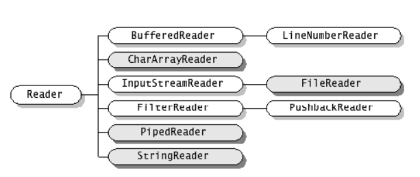
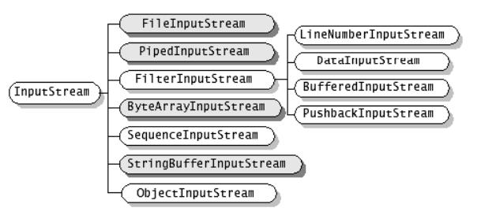
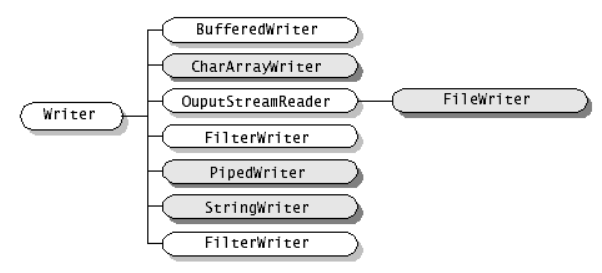
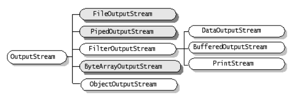
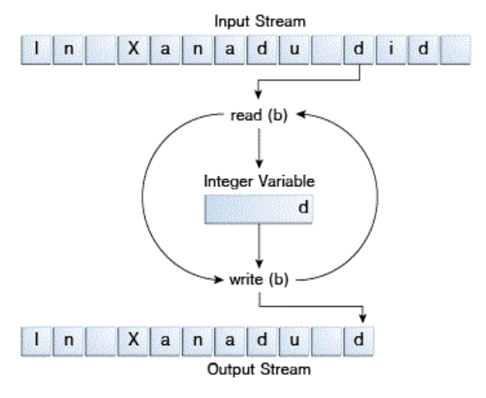

## 13주차 live-study 목차
- [스트림 기반 I/O](#스트림-기반-I/O)
  - [InputStream](#Input-Stream)
  - [OutputStream](#Output-Stream)
  - [ByteStream](#Byte-Stream)
  - [CharacterStream](#Character-Stream)
- [버퍼 기반 I/O](#버퍼-기반-I/O)
  - [플러시](#플러시)
- [채널 기반 I/O](#채널-기반-I/O)
- [표준 스트림](#표준-스트림)
- [파일 읽고 쓰기](#파일-읽고-쓰기)
- [참고](#참고)

### 스트림 기반 I/O
스트림은 일련의 데이터로 소스와 데스티네이션을 갖는다.
디스크 파일을 포함해서 다른 기기, 다른 프로그램 또는 메모리 배열 등 다양한 종류의 소스와 데스티네이션을 가질 수 있다.
스트림을 통해 전달될 수 있는 데이터 역시 단순한 바이트를 포함하여 프리미티브 데이터 타입, 객체 등 다양하다.
스트림이 내부적으로 어떻게 구현되어 있든 모든 스트림은 스트림을 사용할 프로그램에서 볼 때 일련의 데이터이다.

#### Input Stream
소스에서 데이터를 읽기 위해 사용하는 스트림을 인풋 스트림이라 한다.
자바에서 인풋 스트림은 문자 기반 스트림인 경우 `Reader`,
바이트 기반 스트림인 경우 `InputStream`이라는 클래스로 표현되며 여러 자식 클래스를 갖는다.



<br>출처: https://www.iitk.ac.in/esc101/05Aug/tutorial/essential/io/overview.html

#### Output Stream
데스티네이션에 데이터를 쓰기 위해 사용하는 스트림을 아웃풋 스트림이라 한다.
자바에서 아웃풋 스트림은 문자 기반 스트림인 경우 `Writer`,
바이트 기반 스트림인 경우 `OutputStream`이라는 클래스로 표현되며 여러 자식 클래스를 갖는다.



<br>출처: https://www.iitk.ac.in/esc101/05Aug/tutorial/essential/io/overview.html

#### Byte Stream
프로그램에서 8비트 바이트를 읽거나 쓸 때 바이트 스트림을 사용한다.
모든 바이트 스트림 클래스는 `InputStream` 또는 `OutputStream`의 자식이다.

```java
public class CopyBytes {
    public static void main(String[] args) throws IOException {

        FileInputStream in = null;
        FileOutputStream out = null;

        try {
            in = new FileInputStream("input.txt");
            out = new FileOutputStream("output.txt");
            int c;

            while ((c = in.read()) != -1) {
                out.write(c);
            }
        } finally {
            if (in != null) {
                in.close();
            }
            if (out != null) {
                out.close();
            }
        }
    }
}
```

위의 예제를 도식화하면 아래와 같다.



사실 input.txt는 문자 데이터이기 때문에 바이트 스트림을 이용해서 읽는 것보다는
문자 스트림을 이용하는 것이 더 적합하다. 바이트 스트림은 모든 다른 스트림의 기반이기 때문에
어떠한 것도 읽을 수 있지만 로우 레벨이기 때문에 바이트 스트림을 쓰는 대신
해당 데이터에 가장 적합한 스트림을 사용하는 것이 좋다.

#### Character Stream
모든 문자 스트림 클래스는 `Reader` 또는 `Writer`의 자식이다. 

```java
public class CopyCharacters {
    public static void main(String[] args) throws IOException {

        FileReader inputStream = null;
        FileWriter outputStream = null;

        try {
            inputStream = new FileReader("input.txt");
            outputStream = new FileWriter("output.txt");

            int c;
            while ((c = inputStream.read()) != -1) {
                outputStream.write(c);
            }
        } finally {
            if (inputStream != null) {
                inputStream.close();
            }
            if (outputStream != null) {
                outputStream.close();
            }
        }
    }
}
```

바이트 스트림 기반의 읽기/쓰기와 매우 유사하지만 차이점은 `FileInputStream` 대신 `FileReader`를,
`FileOutputStream` 대신 `FileWriter`를 사용했다는 점이다.
위의 두 예제 모두 `int` 변수를 이용하여 읽고 쓰는데,
바이트 스트림 기반에서는 `int` 변수에 8 비트가 담기고,
문자 스트림 기반에서는 `int` 변수에 16 비트가 담긴다.

### 버퍼 기반 I/O
지금까지 살펴본 예제는 버퍼를 사용하지 않는 입출력이었다.
즉, 읽기와 쓰기 요청이 OS에 의해서 직접적으로 처리되었다.
각 요청은 종종 디스크에 대한 접근이나 네트워크 활동과 같이
상대적으로 비싼 연산을 유발할 수 있기 때문에 이런 방식의 입출력을 사용하는 프로그램은 효율적이지 못하다.
이러한 오버헤드를 줄이기 위해서 자바는 버퍼를 사용한 입출력 스트림을 구현하였다.
버퍼 기반 인풋 스트림은 버퍼라고 알려진 메모리 영역에서 데이터를 읽고,
네이티브 입력 API는 오직 버퍼가 비어있을 때만 호출된다.
유사하게 버퍼 기반 아웃풋 스트림은 데이터를 버퍼에 쓰고,
네이티브 출력 API는 오직 버퍼가 가득 차 있을 때만 호출된다.

래핑(wrapping)을 이용하여 버퍼를 사용하지 않는 스트림에서 버퍼를 사용하는 스트림으로 변환할 수 있다.

```java
inputStream = new BufferedReader(new FileReader("xanadu.txt"));
outputStream = new BufferedWriter(new FileWriter("characteroutput.txt"));
```

버퍼 기반 스트림에는 `BufferedInputStream`, `BufferedOutputStream`,
`BufferedReader`, `BufferedWriter`가 있다.

#### 플러시
버퍼가 가득차기를 기다리지 않고 쓰기를 수행하는 것을 플러시라고 한다.
몇몇 버퍼 아웃풋 클래스는 자동 플러시를 지원한다. 자동 플러시는 생성자에 인자를 줌으로써 활성화시킬 수 있는데,
자동 플러시가 활성화된 경우 특정한 이벤트가 발생하면 버퍼가 가득차지 않아도 플러시가 이루어진다.
예를 들면 `PrintWriter`의 경우 자동 플러시가 켜져있으면 `println()` 또는 `format()` 메소드가  호출될 때마다 플러시가 발생한다.
수동 플러시를 하기 위해서는 `flush()` 메소드를 호출하면 된다. `flush()` 메소드는 어느 아웃풋 스트림에서나 유효하지만
버퍼 기반 스트림이 아닌 경우 아무 효과가 없다.

### 채널 기반 I/O
자바의 Non-blocking I/O(이하 NIO)는 기존 스트림 방식과 다르게
채널을 이용해 입력과 출력을 수행한다. 채널이란 스트림과 같이 데이터의 흐름, 데이터의 통로를 추상화시킨 것이다.
NIO에서는 모든 데이터가 버퍼를 통하여 처리된다.


<br>출처: https://medium.com/@nilasini/java-nio-non-blocking-io-vs-io-1731caa910a2

기존 스트림 기반의 blocking I/O는 쓰레드가 `write()` 또는 `read()`를 호출할 경우
쓰레드는 읽을 수 있는 데이터가 있을 때까지 또는 데이터가 완전히 쓰여질 때까지 블락된다.
채널 기반의 NIO는 읽기 또는 쓰기 요청 후에 해당 요청에 대한 응답이 올때까지
기다리지 않고 다른 일을 하러갈 수 있다.

### 표준 스트림
표준 입출력 스트림은 `java.lang.System` 클래스에서 제공된다.
* Standard input
<br>`System.in`을 통해 표준 입력 스트림울 참조할 수 있다. 주로 사용자의 입력을 읽을 때 사용한다.
* Standard output
<br>`System.out`을 통해 표준 출력 스트림울 참조할 수 있다. 주로 사용자에게 정보를 표시해줄 때 사용한다.
* Standard error
<br>`System.err`를 통해 표준 에러 스트림울 참조할 수 있다. 사용자에게 에러 메시지를 표시할 때 사용한다.

### 파일 읽고 쓰기
자바의 NIO를 이용한 파일 읽기

```
List<String> lines = Files.readAllLines(Paths.get(path));
Arrays.stream(lines.toArray[new String[0]]).forEach(System.out::println);
```

자바 NIO를 이용한 파일 쓰기

`Files.write(Paths.get(path), text.getBytes());`

### 참고
[자바 입출력 관련 공식 문서](https://docs.oracle.com/javase/tutorial/essential/io/index.html)
<br>[스탠다드 IO](http://journals.ecs.soton.ac.uk/java/tutorial/java/system/iostreams.html)
<br>[채널 IO 스트림 IO 비교](https://medium.com/@nilasini/java-nio-non-blocking-io-vs-io-1731caa910a2)