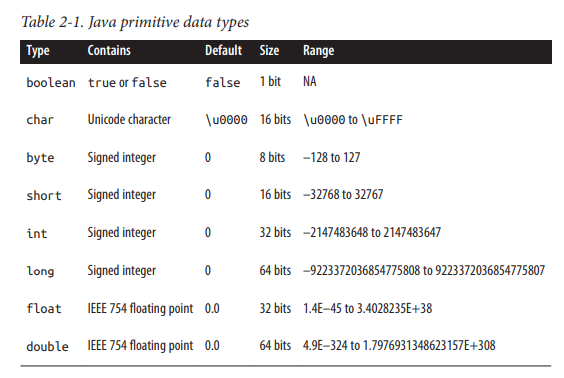
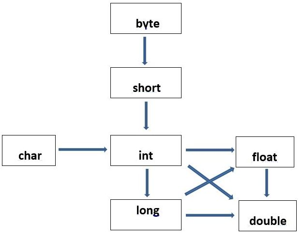

### 목차
- [프리미티브 타입](#프리미티브-타입)
- [프리미티브 타입과 레퍼런스 타입](#프리미티브-타입과-레퍼런스-타입)
- [리터럴](#리터럴)
- [변수 선언 및 초기화](#변수-선언-및-초기화)
- [var](#var)
- [타입 변환](#타입-변환)
- [타입 프로모션](#타입-프로모션)
- [타입 캐스팅](#타입-캐스팅)
- [변수의 스코프와 라이프타임](#변수의-스코프와-라이프타임)
- [1차 및 2차 배열 선언](#1차-및-2차-배열-선언)

### 프리미티브 타입
변수의 데이터 타입은 그 변수가 무엇을 담을 수 있는지, 어떤 연산이 수행될 수 있는지에 대한 정보를 나타낸다.
자바는 8개의 프리미티브 타입을 제공한다. 프리미티브 타입이란 자바에 의해 미리 정의된 타입으로
프리미티브 타입의 이름은 예약된 키워드 해당하여 프로그램에서 사용할 수 없다.
<br>참고: https://docs.oracle.com/javase/tutorial/java/nutsandbolts/datatypes.html


<br>출처: Java In a Nutshell 7th

### 프리미티브 타입과 레퍼런스 타입
변수의 데이터 타입은 다음과 같이 구분할 수 있다.


<br>출처: https://javarevisited.blogspot.com/2015/09/difference-between-primitive-and-reference-variable-java.html

프리미티브 타입의 변수는 실제 값을 담고 있는 반면,
레퍼런스 타입의 변수는 객체가 존재하는 위치를 담고 있다.

`int a = 5;`

예를 들어, 위와 같이 변수를 선언하고 초기화한 경우, 메모리에서 변수 a에 대응되는
공간에는 5라는 값이 저장되어 있다.

`Study study = new Study();`

하지만 위와 같이 stduy라는 레퍼런스 변수를 선언하고 Study 객체를 생성한 경우,
메모리에서 변수 study에 대응되는 공간에는 Study 객체가 존재하는 위치가 저장되어 있다.

### 리터럴
리터럴이란 자바 소스 코드 내에서 상수를 직접적으로 나타내는 문자들의 나열이다.
(상수란 변하지 않는 값을 의미한다.) 다음은 리터럴의 예시이다.

`1 1.0 '1' 1L "one" true false null`

모든 프리미티브 타입은 리터럴을 이용하여 초기화할 수 있다.
레퍼런스 타입의 경우 예외적으로 String만 리터럴을 이용하여 초기화할 수 있다.

### 변수 선언 및 초기화
자바에서 변수의 선언은 다음과 같이 할 수 있다.

`타입 변수명;`

예시는 다음과 같다.

`int a;`

위와 같이 변수 a가 선언된 상태에서
초기화는 다음과 같이 할 수 있다.

`a = 5;`

또는 아래와 같이 선언과 동시에 초기화할 수도 있다.

`int a = 5;`

### var

JDK 10부터 `var`라는 식별자를 사용할 수 있다.
변수의 타입자리에 쓸 수 있으며 null 이외의 값으로 초기화되어야 한다.
컴파일러는 초기화되는 값으로부터 타입을 추론한다.
`var`는 키워드가 아니기 때문에 `var`를 변수나 메소드, 패키지의 이름으로
사용한 경우라면 상관 없지만 클래스나 인터페이스의 이름으로 지은 경우
클래스나 인터페이스의 이름을 변경해야 한다.

```java
URL url = new URL("http://www.oracle.com/"); 
URLConnection conn = url.openConnection(); 
Reader reader = new BufferedReader(
    new InputStreamReader(conn.getInputStream()));
```

```java
var url = new URL("http://www.oracle.com/"); 
var conn = url.openConnection(); 
var reader = new BufferedReader(
    new InputStreamReader(conn.getInputStream()));
```

참고: https://docs.oracle.com/en/java/javase/13/language/local-variable-type-inference.html

### 타입 변환
타입 변환은 프로그래머에 의해 명시적으로 일어날 수도 있고,
컴파일러에 의해 은밀하게 일어날 수도 있다. 전자를 캐스팅, 후자를 타입 프로모션이라 부르며
이 둘 모두 타입 변환에 속한다.

#### 타입 프로모션
```java
float a =  1.0f;
int b = 5;
System.out.println(a + b); // 6.0f
```
단, 타입 프로모션은 역방향으로 일어날 수 없다.
```java
float a =  1.0f;
int b = 5;
int c = a + b; // compile error
```

다음의 그림은 타입 프로모션의 방향을 나타낸 그림이다.


<br>출처: https://www.c-sharpcorner.com/UploadFile/3614a6/type-promotion-in-java

#### 타입 캐스팅
캐스팅 연산자는 `()`이며 다음과 같이 사용할 수 있다.
```java
float a =  1.0f;
int b = 5;
int c = (int)(a + b); // 6
```

### 변수의 스코프와 라이프타임
스코프란 어떤 영역에서 변수에 접근할 수 있는지에 관한 공간적 개념이고,
라이프타임이란 변수가 언제까지 존재하는지에 관한 시간적 개념이다.


<br>출처: https://www.learningjournal.guru/article/programming-in-java/scope-and-lifetime-of-a-variable/

### 1차 및 2차 배열 선언
자바에서는 데이터 타입 뒤에 `[]`를 붙임으로써 배열임을 나타낸다.
n차원 배열을 만들기 위해서는 데이터 타입 뒤에 n 개의 `[]`를 붙이면 된다.
다음은 순서대로 1차원 배열과 2차원 배열이다.

`int [] arr;`

`int [][] arr;`

배열은 프리미티브 타입이 아니기 때문에 new 연산자로 객체를 생성해야 한다.

`int [] arr =  new int [5];`

`int [][] arr = new int [3][6];`

이때, 첫 번째 차원의 배열의 크기는 생략될 수 없다.

```java
int [] arr =  new int []; // compile error
int [][] arr = new int [3][]; // ok
```