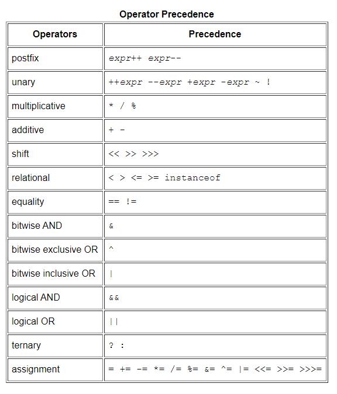

### 목차
- [산술 연산자](#산술-연산자)
- [비트 연산자](#비트-연산자)
- [비교 연산자](#비교-연산자)
- [논리 연산자](#논리-연산자)
- [대입 연산자](#대입-연산자)
- [화살표 연산자](#화살표-연산자)
- [3항 연산자](#3항-연산자)
- [연산자 우선 순위](#연산자-우선-순위)
- [instanceof](#instanceof)

### 산술 연산자
산술 연산자의 피연산자로 정수와 실수가 올 수 있다.
피연산자 중에 하나라도 실수가 있다면 실수 산술 연산이 수행되며,
그렇지 않을 경우에는 정수 산술 연산이 수행된다. (정수 산술 연산과
실수 산술 연산은 나눗셈이 수행되는 방식과 오버플로우와 언더플로우를
처리하는 방식이 다르다.)

#### Addition (+)
\+ 연산자는 두 수를 더하거나 두 개의 문자열을 이어붙인다.
만약 피연산자 중 하나가 문자열이라면 다른 피연산자가 문자열로 변환되어
두 개의 문자열을 이어붙이는 연산이 수행된다(자바의 모든 프리미티브 타입은
자신을 문자열로 변환하는 메소드를 가지고 있다). 산술 연산과
문자열 이어붙이기 연산을 함께 사용할 때는 연산자 우선순위에 유의하고, 괄호를 꼭 사용하자.

`System.out.println("Total: " + 4 / 3); // Total: 1`
<br>`System.out.println("Total: " + 4 + 3); // Total: 34`

#### Substraction (-)
`-` 연산자가 이항 연산자로 사용될 경우 앞의 수에서 뒤의 수를 빼고,
단항 연산자로 사용될 경우 숫자의 부호를 바꾼다.

#### Multiplication (*)

`*` 연산자는 두 피연산자를 곱한다.

#### Division (/)
`/` 연산자는 앞의 수를 뒤의 수로 나눈다. 두 개의 피연산자가 모두
정수일 경우 나눗셈의 결과 역시 정수이다(나머지는 버려진다). 만약
피연산자 중에 실수가 있을 경우 결과 역시 실수가 된다.
정수 연산에서 0으로 나누면 `ArithmeticException`이 발생하지만
실수 연산에서 0으로 나눌 경우 결과는 무한대 또는 `NaN`이다.

`System.out.println(7/3); // 2`
<br>`System.out.println(7/3.0f); // 2.333333f`
<br>`System.out.println(7/0); // ArithmeticException`
<br>`System.out.println(7/0.0) // Infinity`
<br>`System.out.println(0.0/0.0); // NaN`

#### Modulo (%)
`%` 연산자는 앞의 수를 뒤의 수로 나눈 나머지를 구한다.
보통 피연산자로 정수가 오는데, 실수에서도 동작은 하지만
실수 연산이기 때문에 예상과 다른 결과가 나올 수도 있다.

`System.out.println(4.3%2.1); // 0.09999999999999964`
<br>`System.out.println(5%0.0); // NaN`
<br>`System.out.println(0%0.0); // NaN`
<br>`System.out.println(5%0); // ArithmeticException`

### 비트 연산자
피연산자가 소수나 `boolean`, 배열 또는 객체일 경우 비트 연산자를 사용할 수 없다.
비트 연산자의 피연산자 중에 `long` 타입이 존재할 경우 결과는 `long` 타입이다.
그렇지 않은 경우의 결과는 `int` 타입이다.

#### Bitwise complement (~)
피연산자를 이루는 비트 중 0을 1로, 1은 0으로 변환한다.

`byte b = ~12; // ~00001100 => 11110011 or -13 decimal`

#### Bitwise AND (&)
두 피연산자의 같은 자리 비트가 모두 1일 때만 1이고 그 외의 경우는 모두 0이다.

`10 & 7 // 00001010 & 00000111 => 00000010 or 2`

#### Bitwise OR (|)
두 피연산자의 같은 자리 비트가 모두 0일 때만 0이고 그 외의 경우는 모두 1이다.

`10 | 7 // 00001010 | 00000111 => 00001111 or 15`

#### Bitwise XOR (^)
두 피연산자의 같은 자리 비트가 서로 다를 경우에 1이고 같은 경우엔 0이다.

`10 ^ 7 // 00001010 ^ 00000111 => 00001101 or 13`

#### Left shift (<<)
왼쪽 피연산자의 비트를 오른쪽 피연산자 만큼 왼쪽으로 밀고 새로 생긴 공간은 0으로 채운다.

`7 << 3 // 0b00000111 << 3 = 00111000 = 56 = 7*8`

왼쪽 피연산자가 `int`일 경우 4 byte이므로 오른쪽 피연산자는 0~31 사이의 값이어야 하며,
왼쪽 피연산자가 `long`일 경우 8 byte이므로 오른쪽 피연산자는 0~63 사이의 값이어야 한다.

#### Signed right shift (>>)
왼쪽 피연산자의 비트를 오른쪽 피연산자 만큼 오른쪽으로 밀고 새로 생긴 공간은
부호가 -일 경우 1로, +일 경우 0으로 채운다. (연산 결과 부호가 바뀌지는 않는다.)

`27 >> 3 // 00011011 >> 3 = 00000011 = 3 = 27/8`
<br>`-50 >> 2 // 11001110 >> 2 = 11110011 = -13 != -50/4`

#### Unsigned right shift (>>>)
왼쪽 피연산자의 비트를 오른쪽 피연산자 만큼 오른쪽으로 밀고 새로 생긴 공간은 0으로 채운다.
(연산 결과 부호가 바뀔 수 있다.)

`0xff >>> 4 // 11111111 >>> 4 = 00001111 = 15 = 255/16`
<br>`-50 >>> 2 // 0xFFFFFFCE >>> 2 = 0x3FFFFFF3 = 1073741811`

### 비교 연산자
비교 연산자는 동일한지 동일하지 않은지를 검사하거나(equality operators),
대소 관계를 확인하기 위해 사용되며(relational operators)
연산의 결과는 `boolean`이다. `if`문이나 `while`문, `for`문에서 잘 쓰인다.

#### Equals (==)
두 개의 피연산자가 동일할 경우 `true`를 그렇지 않을 경우 `false`를 리턴한다.
프리미티브 타입의 경우 두 피연산자의 값이 동일한지 확인하지만,
참조 타입의 경우 같은 객체 또는 배열을 참조하고 있는지 확인한다.
즉, 참조 변수가 가지고 있는 주소의 값이 일치하는지를 확인한다.
두 객체가 의미상 동등한지 비교하고자 한다면 `==` 연산자를 사용해선 안된다.
메모리의 서로 다른 공간에 위치하는 경우 `==`의 결과는 언제나 `false`이기 때문이다.

#### Not equals (!=)
`==` 연산자와 정반대이다.

이 외에도 `<` `<=` `>` `>=`가 있다.

### 논리 연산자
논리 연산자는 피연산자가 `boolean`이다. 비교 연산의 결과가 `boolean`이므로
논리 연산자를 이용하면 복잡한 비교 연산을 수행하거나 복잡한 조건을 검사할 수 있다.

#### Conditional AND (&&)
두 피연산자 모두 `true`인 경우에만 연산 결과가 `true`이다.
`&&` 연산자는 두 번째 피연산자까지 항상 보는 것이 아니라 조건적으로 보기 때문에
conditional AND라고 불린다. 즉, 첫 번째 피연산자가 `false`인 경우
두 번째 피연산자와 관계 없이 `&&` 연산의 결과는 `false`이므로 자바 인터프리터는
두 번째 피연산자를 건너뛴다. 따라서 side effect를 갖는 표현식과 함께 사용할 때
주의해야 한다.

`if (data.equals(target) && count++)`

위의 상황에서 data와 target이 일치하지 않는다면 count는 증가되지 않는다.

`if (data != null && i < data.length && data[i] != -1)`

위의 상황에서 첫 번째 또는 두 번째 피연산자가 `false`라면 세 번째 피연산자에서
error가 발생하겠지만, conditional AND의 경우 앞에서 `false`라면 뒤까지 갈 일이
없으므로 걱정하지 않아도 된다.

#### Conditional OR (||)
두 피연산자 모두 `false`인 경우에만 `false`이다.
`&&`와 마찬가지로 두 번째 피연산자까지 항상 보는 것이 아니라 조건적으로 보기 때문에
conditional OR라고 불린다. 

#### Boolean NOT (!)
`true`일 경우 `false`이고, `false`일 경우엔 `true`이다.

#### Boolean AND (&)
`&` 연산자가 `boolean` 타입 피연산자에 쓰일 때는 `&&` 연산자와 비슷하게 행동한다.
다만 `&&`와 달리 첫 번째 피연산자가 `false`라고 할지라도 항상 두 번째 피연산자까지 확인한다.

#### Boolean OR (|)
`|` 연산자가 `boolean` 타입 피연산자에 쓰일 때는 `||` 연산자와 비슷하게 행동한다.
다만 `||`와 달리 첫 번째 피연산자가 `true`라고 할지라도 항상 두 번째 피연산자까지 확인한다.

#### Boolean XOR (^)
피연산자 중 하나만 `true`일 때 결과가 `true`이다.
`boolean`에 대해서 `!=` 연산자와 의미가 동일하다.
`&&`, `||`와 달리 항상 두 번째 피연산자까지 확인한다.

### 대입 연산자
대입 연산자는 값을 메모리에 저장한다. 대입 연산자는 다른 모든 이항 연산자와 달리 right-associative하다.
즉, `a=b=c`는 `b=c`부터 수행된다.

자바는 11개의 연산자에 대해 대입 연산자와 결합된 새로운 연산자를 정의한다.
<br>`+=` `-=` `*=` `/=` `%=` `&=` `|=` `^=` `<<=` `>>=` `>>>=`
<br>가령 `x+=2`는 `x=x+2`와 같다. `+=` 연산자를 사용할 경우 왼쪽에 있는
피연산자는 한 번만 계산되므로 주의하자(피연산자가 side effect를 가질 때 다른 결과가 나올 수 있다).

```java
int [] arr = {1, 2, 3};
int index = 0;
arr[index++] += 1;
System.out.println(Arrays.toString(arr)); // [1, 0, 0]
System.out.println(index); // 1

int [] arr2 = {1, 2, 3};
index = 0;
arr2[index++] = arr2[index++] + 1; // 왼쪽 피연산자의 ++부터 수행
System.out.println(Arrays.toString(arr2)); // [3, 2, 3]
System.out.println(index); // 2
```

### 화살표 연산자
The Lambda Arrow Operator, `->` 연산자는 람다 표현식에서 사용되는 특별한 연산자로,
연산자의 왼쪽에는 메소드의 인자가 오고, 오른쪽에는 자바 코드 블록이 온다.

`Runnable r = () -> System.out.println("Hello World");`

### 3항 연산자
The conditional operator, 일명 3항 연산자 `?:`는 `if/else`문의 연산자 버전이라고 할 수 있다.
3항 연산자는 피연산자가 3개인데 첫 번째 피연산자는 `boolean`이거나 연산 결과가
`boolean`이어야 하고, 두 번째 피연산자와 세 번째 피연산자는 어떤 타입이든 올 수 있으나
둘의 타입이 같거나 같은 타입으로 변환이 가능해야만 한다.

첫 번째 피연산자가 `true`일 경우 두 번째 피연산자가 사용되고, `false`일 경우
세 번째 피연산자가 사용된다. Side effect를 이용할 생각이라면
두 번째 피연산자와 세 번째 피연산자 중 하나만 선택된다는 사실을 주의하자.

`int max = (x > y) ? x : y;`

`?:` 연산자는 대입 연산자를 제외한 다른 모든 연산자보다 우선순위가 낮기 때문에
괄호를 반드시 사용해야하는 것은 아니지만 첫 번째 피연산자에 괄호를 치면 가독성이 좋다.

### instanceof
`instanceof` 연산자는 왼쪽 피연산자에 객체나 배열이, 오른쪽 피연산자에는 참조 타입의 이름이 온다.
(피연산자로 프리미티브 타입은 올 수 없다.)
왼쪽 피연산자가 오른쪽 피연산자의 객체라면 결과는 `true`이고, 그렇지 않을 경우 `false`이다.
(만약 왼쪽 피연산자가 `null`일 경우 결과는 항상 `false`이다.) `instanceof`의 결과가
`true`라는 것은 왼쪽 피연산자를 오른쪽 피연산자로 캐스팅해도 안전하다는 것을 의미한다.

```java
// Use instanceof to make sure that it is safe to cast an object
if (object instanceof Point) {
 Point p = (Point) object;
}
```

### 연산자 우선 순위

<br> 출처: https://docs.oracle.com/javase/tutorial/java/nutsandbolts/operators.html

참고: Java in a Nutshell 7th