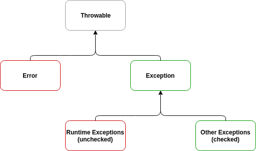

### 목차
- [Error와 Exception](#Error와-Exception)
- [Checked exception](#Checked-exception)
- [Unchecked exception](#Unchecked-exception)
- [throw](#throw)
- [try/catch/finally statement](#try/catch/finally-statement)
- [try-with-resources statement](#try-with-resources-statement)
- [Custom exception](#Custom-exception)
- [참고](#참고)

#### Error와 Exception
Exception이란 예외적인 상황이나 에러가 발생했음을 알리는 시그널로, checked와 unchecked 두 종류가 있다.
예외를 '던진다(throw)'는 것은 시그널을 보낸다는 것을 의미하고,
예외을 '처리한다(handle)'는 것은 예외 상황으로부터 회복하기 위해 필요한 행동을 수행하는 것을 의미한다.
앞서 말한 시그널로써의 exception은 `Throwable` 클래스로 표현되며,
이 클래스의 자식 클래스로 `Error`와 `Exception`가 있는데 전자가 에러를 표현하고,
후자가 예외적인 상황을 나타낸다. 즉, 자바에서는 `Error`와 `Exception`는 클래스로 구분되어 있지만,
의미적으로는 에러도 예외(unchecked exception)에 해당한다.



#### Checked exception

부분적으로 또는 완전히 회복될 수 있으므로 반드시 잡아야 하는 예외이다.
예를 들면 `FileNotFoundException`는 잡은 뒤 파일이 있을법한
다음 위치을 찾게함으로써 처리할 수 있다. 즉, 파일이 현재 없는 것은 예외상황이지만
회복할 수 있는 예외, 이해할 수 있고 예측할 수 있는 failure이다.

checked exception을 던지는 메소드를 작성할 때는 메소드 시그니처에
반드시 `throws` 절을 사용하여 예외를 선언해주어야 한다. 선언하지 않을 경우 컴파일 에러가 발생하며
이 때문에 'checked' exception이라고 불린다.

메소드 자체에서 checked exception을 던지지 않는다고 하더라도 `throws` 절을 통해
checked exception을 선언해주어야 할 때가 있다. 바로 메소드에서 다른 메소드를 호출하는데,
그 메소드가 checked exception을 던질 수 있는 경우이다. 해당 예외에 대한 핸들링 코드를 넣거나
`throws` 절을 통해 예외 처리를 밖으로 던져야만 한다.

#### Unchecked exception

Unchecked exceptions: 회복이 거의 불가능하여 잡아도 별 의미가 없는 예외이다.
런타임에서의 특정 조건이나 라이브러리 코드의 부재로 인해 발생하는 failure와 같이
쉽게 예측할 수 없는 failure로 `OutOfMemory`, `NullPointerException` 등이 있다.

모든 `Error` 타입은 unchecked이고 `Exception` 타입은 `RuntimeException`이라는
자식 클래스만 unchecked이며 나머지는 모두 checked이다.

#### throw
예외를 던질 때 `throw` statement를 사용한다. 다음은 `throw`의 사용 예시이다.
<br>`throw expression;`
<br>이때 expression은 evaluate 결과 exception 객체여야 한다. 
<br>`throw new IllegalArgumentException("x must be >= 0");`


#### try/catch/finally statement
자바는 두 가지 예외처리 메커니즘이 있는데 try/catch/finally statement가 그 중 하나이다.

`try`
<br>`try`절은 예외가 발생할 수 있거나 특별한 클린업 코드가 필요한 코드블럭이다.
그 자체로 특별한 일을 하지는 않으며 `catch`절과 `finally`절에서 예외 처리와 클린업을 수행한다.
`try`절 뒤에 0개 이상의 `catch`절이 올 수 있다.

`catch`
<br>`catch`절은 특정한 예외를 처리하는 코드블럭이다. 각각의 `catch` 블럭은 한 개 이상의 예외를 처리할 수 있고,
각각의 예외는 `|`를 통해 구분한다. `catch`절에서는 잡은 예외 객체를 참조할 수도 있다.
잡고자하는 예외는 반드시 `Throwable`의 자식 클래스여야 한다.

모든 가능한 예외 상황에서 `catch`절을 통해 예외를 처리해야하는 것은 아니다.
예외가 전파되어 최초에 호출한 메소드에서 잡히도록 그대로 내버려 두는 것이 바른 대응일 때도 있다.

`NullpointerException` 같은 경우 아예 잡지 않음으로써 자바 인터프리터에 의해 종료되도록 하는게 바른 대응이다.

`finally`
<br>`catch`절 뒤에(`catch`절이 없는 경우 `try`절 뒤에) `finally`절이 오는데 이는 선택사항이다.
`finally`절은 앞에서 어떤 일이 일어나든 관계없이 실행이 보장되기 때문에
파일을 닫거나 네트워크 연결을 끊는 등의 정리하는 코드가 담겨있다.
`finally`절에서는 원한다면 제어를 바꿀 수 있다. `finally`에서 `return`, `continue`, `break`를 통해
원래의 흐름이 어떻든 끊는 것도 가능하고, `throw` statement를 통해 기존에 잡힌 예외가 아닌
다른 예외를 던지는 것도 가능하다.

```java
try {
    // 직접 예외를 던지거나 혹은 예외를 던지는 메소드를 호출함으로써
    // 간접적으로 예외를 던질 수 있다.
}
catch (SomeException e1) {
    // SomeException이라는 타입(하위 타입 포함)의 특정 예외를 잡는다.
    // e1을 통해 잡힌 예외 객체를 참조할 수 있다.
}
catch (AnotherException | YetAnotherException e2) {
    // AnotherException 또는 YetAnotherException 타입(하위 타입 포함)의 예외를 잡는다.
}
finally {
    // try절이 맨 위부터 맨 아래까지 모두 실행되든,
    // break, continue, return 등을 만나 도중에 끝나든,
    // 예외에 의해 도중에 끝나든(catch에서 잡은 예외든 잡지 못한 예외든 관계없이)
    // 항상 실행되는 블럭이다.
    // 단, try절에서 System.exit()을 호출하면 인터프리터는 finally절이 실행되기 전에 종료한다.
}
```

#### try-with-resources statement/
자바 7부터 자동으로 자원을 반납해주는 메커니즘, try-with-resources를 제공한다.
```java
try (InputStream is = new FileInputStream("/Users/ben/details.txt")) {
}
```
`try` 괄호 안에서 생성되는 객체의 스코프는 `try` 블럭이며,
블럭이 어떻게 끝나는가와 관계없이 자동으로 정리된다.

#### Custom exception
Exception을 만들기 위해서는 `Throwable`의 하위 클래스로 만들어야 하는데,
checked exception으로 만들고 싶은 경우 `Exception` 클래스의 하위 클래스로,
unchecked exception으로 만들고 싶은 경우 `RuntimeException` 클래스의 하위 클래스로 만들면 된다.

```java
// Checked exception 생성
public class IncorrectFileNameException extends Exception { 
    public IncorrectFileNameException(String errorMessage) {
        super(errorMessage);
    }
}

// Unchecked exception 생성
public class IncorrectFileExtensionException 
  extends RuntimeException {
    public IncorrectFileExtensionException(String errorMessage, Throwable err) {
        super(errorMessage, err);
    }
}


// 사용 예시
try (Scanner file = new Scanner(new File(fileName))) {
    if (file.hasNextLine()) {
        return file.nextLine();
    } else {
        throw new IllegalArgumentException("Non readable file");
    }
} catch (FileNotFoundException err) {
    if (!isCorrectFileName(fileName)) {
        throw new IncorrectFileNameException( // checked
          "Incorrect filename : " + fileName , err);
    }
    //...
} catch(IllegalArgumentException err) {
    if(!containsExtension(fileName)) {
        throw new IncorrectFileExtensionException( // unchecked
          "Filename does not contain extension : " + fileName, err);
    }
    //...
}
```

#### 참고
[create a custom exception in java](https://www.baeldung.com/java-new-custom-exception)
<br>Java in a Nutshell 7th